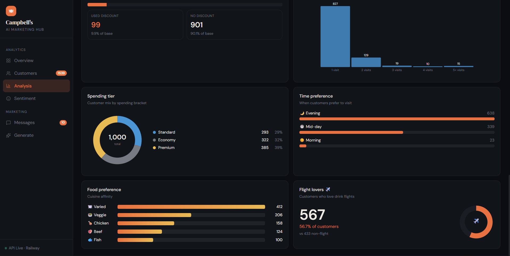
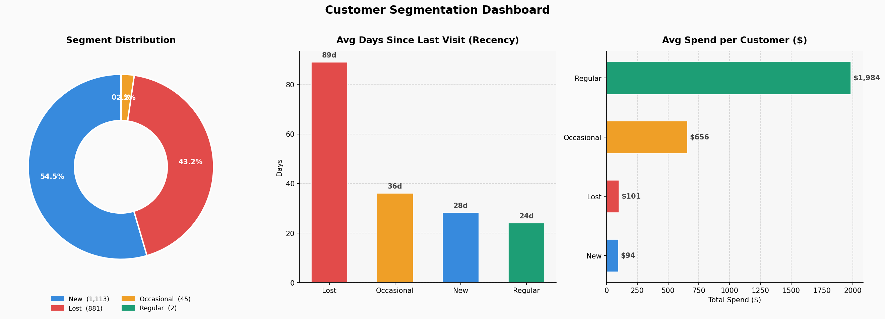
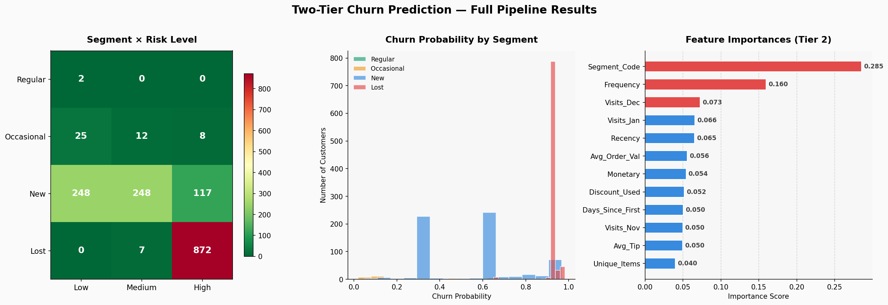
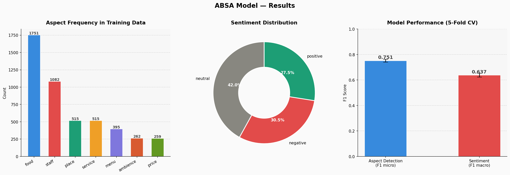

<div align="center">

# Campbell's AI Marketing Hub

**A fully deployed, end-to-end AI marketing system built for a real restaurant. Customer segmentation, churn prediction, sentiment analysis, behavioral profiling, and personalized message generation, all in one platform.**

[](https://python.org)
[](https://fastapi.tiangolo.com)
[](https://react.dev)
[](https://supabase.com)
[](https://railway.app)
[](https://vercel.com)
[](https://xgboost.readthedocs.io)
[](https://scikit-learn.org)
[](LICENSE)

[Live Dashboard](https://campbells-ai-hub.vercel.app) · [API Docs](https://churn-prediction-production-a6ad.up.railway.app/docs) · [Notebook](notebooks/campbell_ai_marketing.ipynb)

</div>

---



---


## Screenshots

**Overview Dashboard**


**Churn Prediction Results**


**Aspect-Based Sentiment Analysis**


---

## What this is

This started as a hackathon submission. I did not finish it in time. A few months later I rebuilt it properly, because the problem was genuinely interesting and I wanted to see what a complete version would look like.

Campbell's is a flight-themed restaurant in the US. They had transaction data, customer reviews, and a menu, but no way to make sense of any of it systematically. This project tries to solve that. It identifies which customers are likely to stop coming back, understands what those customers actually liked or disliked, builds a behavioral profile for each one, and generates a personalized re-engagement message that reflects all of that context.

The whole thing is live. The API runs on Railway, the database is on Supabase, and the dashboard is deployed and connected to real data.

It covers 12,545 transactions across 2,041 customers from November 2023 to February 2024.

---

## Table of Contents

- [Live System](#live-system)
- [Architecture](#architecture)
- [Analysis and Charts](#analysis-and-charts)
- [Machine Learning Pipeline](#machine-learning-pipeline)
- [API Reference](#api-reference)
- [Dashboard](#dashboard)
- [Dataset](#dataset)
- [Results](#results)
- [Tech Stack](#tech-stack)
- [Project Structure](#project-structure)
- [Local Setup](#local-setup)
- [Design Decisions](#design-decisions)
- [What I Learned](#what-i-learned)

---

## Live System

| Component | URL | Status |
|---|---|---|
| Frontend Dashboard | [campbells-ai-hub.vercel.app](https://campbells-ai-hub.vercel.app) | Live |
| FastAPI Backend | [churn-prediction-production-a6ad.up.railway.app](https://churn-prediction-production-a6ad.up.railway.app) | Live |
| Interactive API Docs | [/docs](https://churn-prediction-production-a6ad.up.railway.app/docs) | Live |
| Database | Supabase PostgreSQL | Live |

---

## Architecture

```
┌─────────────────────────────────────────────────────────────────┐
│                        DATA SOURCES                             │
│  Marketing_data.csv   Train_Sentiment.csv   Campbell_Menu.xlsx  │
│  12,545 transactions  2,195 labeled reviews  986 menu items     │
└──────────────────┬──────────────────────────────────────────────┘
                   │
                   ▼
┌─────────────────────────────────────────────────────────────────┐
│                    ML PIPELINE (Python)                         │
│                                                                  │
│  Section 1          Section 2          Section 3                │
│  RFM Analysis   ->  Two-Tier Churn  -> ABSA Pipeline            │
│  KMeans (k=4)       XGBoost + Rules    TF-IDF + LogReg          │
│                                                                  │
│  Section 4          Section 5                                   │
│  Customer       ->  Message                                     │
│  Profiling          Generator                                   │
│  7 features         Groq LLaMA 3.3                              │
└──────────────────┬──────────────────────────────────────────────┘
                   │  pickle files
                   ▼
┌─────────────────────────────────────────────────────────────────┐
│                   FastAPI Backend (Railway)                     │
│  /api/segment    /api/churn    /api/sentiment                   │
│  /api/full-pipeline    /api/analysis/*                          │
│  /api/customers  /api/customer-profile/{id}                    │
└──────────┬──────────────────────────┬───────────────────────────┘
           │                          │
           ▼                          ▼
┌──────────────────┐      ┌───────────────────────┐
│ Supabase         │      │ React Frontend         │
│ PostgreSQL       │      │                        │
│                  │      │ Overview Dashboard     │
│ customers        │      │ Customer Explorer      │
│ messages_log     │      │ Analysis Page          │
│ absa_predictions │      │ Sentiment Page         │
└──────────────────┘      │ Generate Page          │
                          │ Messages Log           │
                          └───────────────────────┘
```

---

---

## Analysis and Charts

Every chart in the dashboard is generated from live Supabase data via the analysis endpoints. Here is what each one shows and why it was built.

---

### Segmentation Charts


Three charts are generated from the RFM clustering output.

**Segment Distribution (donut chart)**

Shows the breakdown of all 2,041 customers across the four segments. New customers make up 54.5% of the base, Lost customers are 43.2%, Occasional are 2.2%, and Regular are 0.1%. The donut format makes the imbalance immediately visible, which is the point. When 43% of your customer base is in the Lost segment, the re-engagement problem becomes concrete rather than abstract.

**Average Days Since Last Visit by Segment (bar chart)**

Lost customers have not visited in an average of 89 days. New customers last visited 28 days ago. Occasional customers 36 days. Regular customers 24 days. This chart is why recency is one of the strongest features in the churn model. The gap between Lost and everything else is not subtle.

**Average Spend per Customer by Segment (horizontal bar chart)**

Regular customers spend an average of $1,984. Occasional customers spend $656. Lost and New customers both sit around $94 to $101. This makes the business case for re-engagement concrete. A Lost customer who comes back and becomes Occasional is worth roughly 6x their current spend. The revenue upside is not speculative.

---

### Churn Prediction Charts


Three charts are generated from the two-tier churn model output.

**Segment x Risk Level Heatmap**

A color-coded grid showing how customers in each segment distribute across Low, Medium, and High risk levels. All 879 Lost customers land in High risk. Both Regular customers land in Low risk. New customers are spread across all three bands depending on how recently they visited. This chart connects the segmentation output directly to the churn model output and makes it easy to see which segment needs the most urgent attention.

**Churn Probability Distribution by Segment (histogram)**

Shows the distribution of churn probability scores across all 1,539 scored customers, colored by segment. The Lost segment clusters tightly around 0.90 to 0.92. The New segment spreads across 0.30 to 0.92 depending on recency. The Regular and Occasional segments cluster in the low end. This distribution validates that the model is separating segments correctly rather than producing uniform scores.

**Feature Importances (horizontal bar chart)**

Shows which features drive the XGBoost Tier 2 model. Segment_Code from the KMeans clustering is the top feature at 0.2852. Frequency is second at 0.1595. Monthly visit counts for December and January follow. Recency, which dominated the naive first version of the model, sits at 0.0655 because the time-based split and tier separation gave the model other signals to learn from.

---

### ABSA Charts


Three charts are generated from the sentiment analysis pipeline output.

**Aspect Frequency in Training Data (bar chart)**

Shows how many times each of the seven aspects appears across 2,195 training reviews. Food is mentioned 1,751 times, staff 1,082 times, service and place 515 times each, menu 395 times, and ambience and price around 260 times each. This tells you what customers talk about most when they review a restaurant, which informs how much training signal is available per aspect.

**Sentiment Distribution (donut chart)**

Shows the overall split across all aspect-sentiment pairs in the training data. Neutral makes up 42%, negative 30%, positive 28%. The roughly balanced distribution matters because it means the model is not being trained on an artificially skewed dataset. Real restaurant reviews tend to mix praise and complaint in the same piece of text, and the training data reflects that.

**Model Performance (bar chart with error bars)**

Shows the 5-fold cross-validation scores for both models with standard deviation error bars. Aspect detection scores 0.751 F1 micro plus or minus 0.011. Sentiment classification scores 0.638 F1 macro plus or minus 0.015. The tight error bars indicate the scores are stable across folds rather than being driven by a single lucky split.

---

## Machine Learning Pipeline

### Section 1 - Customer Segmentation

**The problem:** 2,041 customers with no labels, no history of how they were categorized, nothing. The goal was to split them into meaningful groups that the business could actually act on.

**Approach:** RFM analysis (Recency, Frequency, Monetary) combined with KMeans clustering.

```python
rfm = transactions.groupby('customer_id').agg(
    Recency   = ('date',   lambda x: (snapshot - x.max()).days),
    Frequency = ('date',   'nunique'),
    Monetary  = ('total',  'sum')
)

# k=4 was chosen via Silhouette Score testing (scored 0.4539)
km = KMeans(n_clusters=4, random_state=42)
rfm['Segment'] = km.fit_predict(StandardScaler().fit_transform(rfm))
```

Clusters were labeled automatically by sorting on average recency. The lowest recency cluster is the most active, so it gets labeled Regular, and so on down to Lost.

**What came out:**

| Segment | Avg Recency | Avg Frequency | Avg Spend | Count |
|---|---|---|---|---|
| Regular | 24 days | 25 visits | $1,984 | 2 |
| Occasional | 36 days | 5 visits | $656 | 45 |
| New | 28 days | 1 visit | $94 | 1,113 |
| Lost | 89 days | 1 visit | $101 | 881 |

The 43% churn rate in the data is real. Most people tried the restaurant once and never came back, which is actually the main thing the re-engagement system is designed to address.

---

### Section 2 - Churn Prediction

**The problem:** Predict which customers will not return, without the model cheating.

The first version of this had a 0.9999 AUC and was completely wrong. The labels were coming from the same KMeans clusters that generated the features, so the model was just learning to reconstruct the clustering decision. It looked perfect and was useless.

The rebuilt version uses a proper time-based split:
- Features come from November 2023 to January 2024
- Labels come from whether the customer actually showed up in February 2024

The model never sees anything from the future.

**Two-tier design:**

One-time visitors make up 64% of the customer base. They have a single transaction on record. There is nothing for a model to learn from with that little data, so they get rule-based scoring instead.

```
Tier 1 - Rule-Based (1,297 one-time customers)
  Recency < 14 days  -> 30% churn probability
  Recency 14-30 days -> 65% churn probability
  Recency > 30 days  -> 92% churn probability

Tier 2 - XGBoost (242 repeat customers)
  12 behavioral features + Segment_Code from Section 1
  5-Fold Stratified CV: ROC-AUC 0.8438
```

One thing that made a real difference: passing the KMeans segment label from Section 1 as a feature in the XGBoost model. AUC went from 0.70 to 0.84 because of that one addition. The segmentation and churn models are not independent, they are explicitly connected.

**Feature importances (Tier 2):**

| Feature | Importance |
|---|---|
| Segment_Code | 0.2852 |
| Frequency | 0.1595 |
| Visits_Dec | 0.0728 |
| Visits_Jan | 0.0656 |
| Recency | 0.0655 |

---

### Section 3 - Aspect-Based Sentiment Analysis (ABSA)

**The problem:** A restaurant needs more than "this review is positive." They need to know if the food was good but the service was bad, or if the ambience was the problem, or if the price was the complaint. Standard sentiment analysis cannot do that.

The pipeline has three parts.

**Part 1 - Aspect Detection**

Multi-label classification across seven aspects: food, staff, service, place, menu, ambience, price. A review can mention multiple aspects so it is a one-versus-rest setup.

```python
mlb          = MultiLabelBinarizer(classes=ASPECTS)
tfidf        = TfidfVectorizer(ngram_range=(1, 3), max_features=8000)
aspect_model = OneVsRestClassifier(LogisticRegression())
# 5-fold CV F1 micro: 0.7513
```

**Part 2 - Sentiment per Aspect**

The key insight here is that you cannot just classify sentiment on the whole review. "The food was amazing but the service was slow" should give positive for food and negative for service. To do that, the review and the aspect are concatenated as a single input:

```python
sent_df['Input'] = sent_df['Review'] + ' [ASPECT] ' + sent_df['Aspect']
# 5-fold CV F1 macro: 0.6375
```

**Part 3 - Opinion Extraction**

Rule-based extraction using keyword matching and a context window of plus or minus three words to pull the actual opinion phrase from the sentence.

**Output example:**
```json
{
  "aspects":    ["food", "service"],
  "sentiments": ["positive", "negative"],
  "triplets": [
    {"aspect": "food",    "opinion": "food was amazing",       "sentiment": "positive"},
    {"aspect": "service", "opinion": "service was really slow", "sentiment": "negative"}
  ]
}
```

**On why transformers were not used:** The competition required CPU-only inference with low latency. DistilBERT would get to around 85% F1 but needs 250MB of weights and several seconds per batch on CPU. The TF-IDF approach hits 0.75 F1 in under 50ms per review. For a live API endpoint that needs to respond in under 3 seconds total, that tradeoff is worth it. The codebase has a transformer upgrade path behind a config flag if someone wants to run it on a machine with a GPU.

---

### Section 4 - Customer Profiling

**The problem:** Knowing that a customer has a 92% churn probability is useful. Knowing that they are a Premium evening regular who orders Margarita Rock Flights with Tajin and cares mostly about food quality is much more useful.

Seven behavioral features are extracted from each customer's transaction history:

```python
profile = {
    'spending_tier'    : pd.qcut(total_spend, q=3,
                                 labels=['Economy', 'Standard', 'Premium']),

    'time_preference'  : 'Morning'  if avg_hour < 12
                         else 'Mid-day' if avg_hour < 17
                         else 'Evening',

    'food_preference'  : max(protein_counts, key=protein_counts.get),

    'drink_vs_food'    : 'Drinks' if drink_pct > 0.6
                         else 'Food' if drink_pct < 0.4
                         else 'Mixed',

    'favorite_items'   : top_3_items_by_spend,
    'favorite_modifier': most_common_order_modifier,
    'is_flight_lover'  : flight_item_percentage > 0.5,
}
```

Some interesting things that came out of this:

- 56.7% of customers are flight lovers
- 65% visit in the evening
- 39% are Premium spenders
- Food-focused customers outnumber Drinks-focused about 4 to 1, which is surprising for a place that markets itself on drink flights

---

### Section 5 - Personalized Message Generation

**The problem:** Generate re-engagement messages that do not sound like they came from a template.

The approach is to build a structured prompt from all the signals collected in the previous sections and send it to Groq LLaMA 3.3 70B with JSON mode enforced. The prompt includes the customer's segment, churn risk, days since last visit, spending tier, time preference, food preference, favorite modifier, flight lover status, ABSA-detected liked and disliked aspects, and a set of persona notes that translate the data into tone instructions.

The difference that makes:

Generic version:
> "We miss you! 20% off your next visit."

Enriched version for a Premium, evening, flight-lover, Tajin-modifier customer with negative service sentiment:
> "Your table is boarding. As one of our most valued guests, we have cleared the runway for your return. 20% off your next evening flight. We know you love your Margarita Rock with Tajin, and we have been working on making the full experience match the food. Fly back to Campbell's."

Three formats are generated per customer: SMS (160 chars), Email (subject and body), App notification (80 chars).

---

## API Reference

Base URL: `https://churn-prediction-production-a6ad.up.railway.app`

### Core Endpoints

```
POST /api/segment           - Returns customer segment from RFM values
POST /api/churn             - Returns churn probability and risk level
POST /api/sentiment         - Returns ABSA triplets from a review
POST /api/generate-message  - Returns personalized SMS, email, app notification
POST /api/full-pipeline     - Runs all of the above in one call
```

### Data Endpoints

```
GET  /api/dashboard
GET  /api/customers?segment=Lost&risk_level=High&page=1&page_size=50
GET  /api/customer-profile/{customer_id}
GET  /api/messages-log
```

### Analysis Endpoints

```
GET  /api/analysis/kpis
GET  /api/analysis/rfm
GET  /api/analysis/churn-distribution
GET  /api/analysis/monthly-visits
GET  /api/analysis/revenue
GET  /api/analysis/sentiment-breakdown
GET  /api/analysis/profiles
```

### Example Request

```bash
curl -X POST https://churn-prediction-production-a6ad.up.railway.app/api/full-pipeline \
  -H "Content-Type: application/json" \
  -d '{
    "customer_id": "342.0",
    "recency": 89,
    "frequency": 2,
    "monetary": 266.17,
    "favorite_items": ["Margarita Rock Flight", "Taco Flight"],
    "review": "The food was amazing but the service was really slow"
  }'
```

**Response:**
```json
{
  "segment": "Lost",
  "churn_probability": 0.9285,
  "risk_level": "High",
  "tier": "XGBoost",
  "discount_offered": "20%",
  "profile": {
    "spending_tier": "Premium",
    "time_preference": "Mid-day",
    "food_preference": "veggie",
    "is_flight_lover": true
  },
  "absa": {
    "aspects": ["food", "service"],
    "sentiments": ["positive", "negative"],
    "triplets": [
      {"aspect": "food",    "opinion": "food was amazing",       "sentiment": "positive"},
      {"aspect": "service", "opinion": "service was really slow", "sentiment": "negative"}
    ]
  },
  "messages": {
    "sms": "Fly back to Campbell's for 20% off. Your VIP table is boarding.",
    "email": {
      "subject": "Your Table is Boarding: A Royal Welcome Back",
      "body": "..."
    },
    "app_notification": "Boarding now! 20% off your next flight"
  }
}
```

---

## Dashboard

The frontend is a React dashboard built with Lovable, connected to the FastAPI backend and Supabase.

**Overview Page**

KPI cards showing total customers, churn rate, retained count, and high-risk count. Segment donut chart from RFM clustering. Risk level distribution from the two-tier churn model. RFM averages by segment. Top at-risk customers sorted by churn probability.

**Customer Explorer**

All 1,539 scored customers, searchable and filterable by segment and risk level. Clicking any row opens a profile sidebar with RFM stats, a churn probability gauge, behavioral DNA badges, favorite modifier, favorite items as chips, suggested discount, and buttons to generate a message or view message history for that customer.

**Analysis Page**

RFM scatter plot colored by segment. Churn probability histogram. Average churn by segment. Revenue by segment. Monthly visit volume across November, December, and January. Spend distribution by bracket. A customer profiling section with spending tier donut, time preference bars, food preference bars, and a flight lovers metric.

**Sentiment Page**

Per-aspect sentiment breakdown across 536 test reviews, with positive, neutral, and negative proportions for all seven aspects. A live ABSA tester where you can paste any review and get instant triplet extraction from the deployed model.

**Generate Page**

Type a Customer ID and the profile auto-fills from Supabase. Add an optional review to trigger ABSA. Hit Generate and watch the five-step pipeline run: Segment, Churn Score, ABSA, Message, Log. Results come back as an SMS bubble, email mockup, and app notification card, each with a copy button.

**Messages Page**

Full log of all generated messages with customer context, aspect badges colored by sentiment, and SMS, Email, and App tabs per message card.

---

## Dataset

| File | Description | Rows |
|---|---|---|
| `Marketing_data.csv` | Raw POS transaction data | 12,545 |
| `Train_Sentiment.csv` | Labeled restaurant reviews | 2,195 |
| `sample_submission.csv` | Test reviews for ABSA | 536 |
| `Campbell_Menu_Data.xlsx` | Full menu with categories and prices | 986 |

Transaction fields: Order Date, Menu Item, Price, Qty, Total, Tip, Discount, Order Source, Modifiers, Last 4 Card Digits (customer proxy), Voided flag.

Sentiment fields: Review text, Aspects list, Sentiment list, Feature Opinion list.

---

## Results

| Model | Metric | Score |
|---|---|---|
| Customer Segmentation | Silhouette Score | 0.4539 |
| Churn Prediction Tier 2 | ROC-AUC (5-Fold CV) | 0.8438 |
| Aspect Detection | F1 micro (5-Fold CV) | 0.7513 |
| Sentiment Classification | F1 macro (5-Fold CV) | 0.6375 |

**Business output:**
- 881 Lost customers identified for re-engagement
- 997 High-risk customers flagged across both tiers
- 56.7% of customers identified as flight lovers and used in message personalization
- 39% Premium spenders receiving VIP-tone messaging
- End-to-end message generation in 2 to 4 seconds via Groq LLaMA 3.3 70B

---

## Tech Stack

**Machine Learning**
- scikit-learn: TF-IDF, Logistic Regression, KMeans, MultiLabelBinarizer
- XGBoost: two-tier churn prediction
- pandas, numpy: data processing and feature engineering

**Backend**
- FastAPI: REST API with automatic OpenAPI docs
- supabase-py: PostgreSQL client
- Groq API: LLaMA 3.3 70B for message generation
- Uvicorn: ASGI server
- Railway: deployment

**Frontend**
- React 18, Tailwind CSS, Recharts, shadcn/ui

**Database**
- Supabase PostgreSQL with three tables: customers, messages_log, absa_predictions

---

## Project Structure

```
campbell-ai-marketing/
│
├── Backend/
│   ├── main.py                          # FastAPI app, v4.0, 16 endpoints
│   ├── requirements.txt
│   ├── Procfile
│   ├── runtime.txt                      # Python 3.12
│   ├── kmeans_model.pkl
│   ├── scaler.pkl
│   ├── cluster_map.pkl
│   ├── churn_model_tier2.pkl
│   ├── churn_features.pkl
│   ├── aspect_model.pkl
│   ├── tfidf_aspect.pkl
│   ├── mlb.pkl
│   ├── sentiment_model.pkl
│   └── tfidf_sent.pkl
│
├── Datasets/
│   ├── Marketing_data.csv
│   ├── Train_Sentiment.csv
│   ├── sample_submission.csv
│   └── Campbell_Menu_Data_-_2.xlsx
│
├── Models/
│   ├── churn_scores_final.csv
│   ├── customer_profiles.csv
│   ├── enriched_customer_profiles.csv
│   ├── absa_predictions.csv
│   └── personalized_messages.csv
│
├── notebooks/
│   └── campbell_ai_marketing.ipynb      # Full pipeline, 5 sections
│
├── scripts/
│   ├── customer_segmentation.py
│   ├── churn_prediction_v3.py
│   ├── absa_model.py
│   ├── section5_customer_profiling.py
│   └── seed_supabase.py
│
└── README.md
```

---

## Local Setup

**Requirements:** Python 3.12, Git

**Clone the repo**
```bash
git clone https://github.com/MurtazaMajid/campbells-ai-hub.git
cd campbells-ai-hub/Backend
```

**Install dependencies**
```bash
pip install -r requirements.txt
```

**Set environment variables**
```bash
export GROQ_API_KEY="your_groq_api_key"
export SUPABASE_URL="https://your-project.supabase.co"
export SUPABASE_KEY="your_supabase_anon_key"
export DATA_DIR="."
```

**Generate model files**
```bash
python scripts/customer_segmentation.py
python scripts/churn_prediction_v3.py
python scripts/absa_model.py
python scripts/section5_customer_profiling.py
```

**Seed the database**
```bash
python scripts/seed_supabase.py
```

**Run the API**
```bash
uvicorn main:app --reload --port 8000
# Open http://localhost:8000/docs
```

> The frontend is deployed on Vercel at [campbells-ai-hub.vercel.app](https://campbells-ai-hub.vercel.app). To run it locally, clone the frontend repo and follow the Vercel CLI instructions.

---

## Design Decisions

**On the two-tier churn model**

The first version used KMeans clusters as labels and trained XGBoost on the same RFM features. It got 0.9999 AUC and was completely wrong. The model was just learning to reconstruct the clustering boundary, not predicting anything about future behavior.

The rebuild uses a time-based split with February 2024 as the holdout period. One-time visitors get rule-based scoring because a model trained on one data point per customer would learn nothing useful. These are explicit, defensible choices rather than tricks to inflate a metric.

**On TF-IDF vs transformers**

The competition required CPU-only inference. DistilBERT gets to around 85% F1 but needs 250MB of weights and 3 to 5 seconds per batch on CPU. TF-IDF plus Logistic Regression gets 0.75 F1 in under 50ms. For a real-time API that needs to respond in under 3 seconds total, that is the right tradeoff. A transformer upgrade path is in the codebase behind a config flag.

**On Groq vs OpenAI**

Groq's LPU inference is about 10x faster than OpenAI for generation tasks. LLaMA 3.3 70B on Groq consistently returns well-formed JSON in 1.5 to 2 seconds. For a dashboard where someone is watching a loading indicator, that matters.

**On why ML models are not stored in the database**

Pickle files are loaded once at startup and held in memory. Reading from a database on every prediction request would add 50 to 100ms of unnecessary latency per call. Supabase is used for customer data and message logs, not as a model registry.

**On KMeans vs DBSCAN or GMM**

The business needed exactly four segments with interpretable labels. KMeans with k=4 produces clusters that map cleanly to New, Occasional, Regular, and Lost. DBSCAN produces an arbitrary number of clusters with noise points. GMM requires assumptions about cluster shape. When k is known and interpretability is a hard requirement, KMeans is the right choice.

---

## What I Learned

The hardest part of this project was not writing the models. It was making them work together without leaking information between them. The decision to pass the KMeans segment label into XGBoost as a feature took a while to get right, because you have to be careful about when that label is computed and what data it was computed from.

Real POS data is messier than any tutorial dataset. Dollar signs in numeric columns, voided transactions mixed into active orders, modifiers as unstructured free text, customer IDs stored as floats. A significant chunk of the total time went into cleaning before any modeling could happen.

The 0.9999 AUC mistake was actually useful. It taught me to think carefully about where labels come from before trusting a metric. A model that reconstructs its own training signal looks perfect and predicts nothing. Catching that and fixing it produced a more honest 0.84, which is a better number to put in front of someone who knows what they are looking at.

The deployment side was simpler than expected. Railway, Supabase, and a React frontend give you a genuinely production-like stack as a solo developer, and the GitHub-to-deployment workflow means updates take about two minutes to go live.

---

## Acknowledgments

Built on data from the AI Hacktopia competition (March 2024). Transaction data belongs to Campbell's Restaurant. This project is for educational and portfolio purposes only.

---

<div align="center">

Built by [Murtaza Majid](https://github.com/MurtazaMajid)

[](https://github.com/MurtazaMajid)
[](https://linkedin.com/in/murtaza-majid/)

</div>
